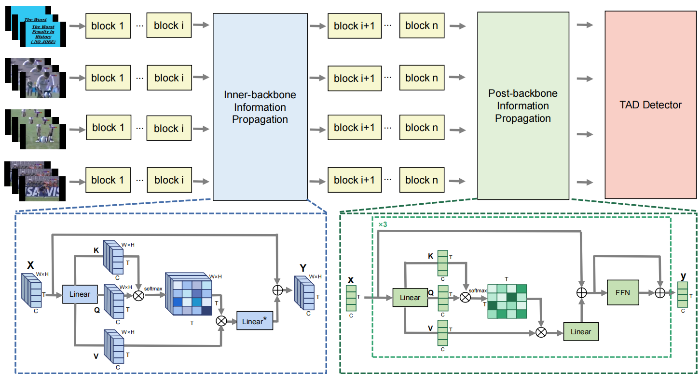

# ViT-TAD
Our paper is available in [ViT-TAD](https://arxiv.org/abs/2312.01897) 
# News
[2024.5.4] The code for THUMOS14 and ActivityNet-1.3 is updated. <br>
[2023.2.27] Our ViT-TAD has been accepted by CVPR2024. The code will be updated soon. <br>

# Overview


# Environment preparation

**1:  Create environment**

```
conda env create -f requirements/vittad.yml
```

**2:  Activate environment**

```
conda activate vittad
```

**3:  Install other dependencies**

``` 
pip install -v -e .
```

# Data preparation

**1:  Download videos**

For **THUMOS14**, please check [BasicTAD](https://github.com/MCG-NJU/BasicTAD) for downloading videos.

Supposing these videos are in the following path:

```
data
├── thumos_video_val
	├── video_validation_0000051.mp4
	└── .....
└── thumos_video_test
	├── video_test_0000004.mp4
	└── .....
```

For **ActivityNet-1.3**, please check [TALLFormer](https://github.com/klauscc/TALLFormer) for downloading videos.

Supposing these videos are in the following path:

```
data
└── anet
     ├── anet_train
         ├── 2aHetC-N-P4.avi
         └── .....
     └── anet_val
     	 ├── NjTk2naIaac.avi
     	 └── .....
```

**2:  Prepare  frames and videos**

For **THUMOS14**, run the following command to prepare videos in 8FPS

 ```
#training set
bash preprocess/extract_thumos_val_videos_in_8fps.sh
#testing set
bash preprocess/extract_thumos_test_videos_in_8fps.sh
 ```

For **ActivityNet-1.3**, run the following command to extract 768 frames for each video

```
#training set
python preprocess/extract_anet_frames.py --video_dir ./data/anet/anet_train --output_dir ./data/anet/afsd_anet_768frames/training
#testing set
python preprocess/extract_anet_frames.py --video_dir ./data/anet/anet_val --output_dir ./data/anet/afsd_anet_768frames/validation
```

**3:  Prepare pretrained weights**

We adopt pre-trained model ViT-B from  [VideoMAE v2](https://https://github.com/OpenGVLab/VideoMAEv2). You can also download this model from here [link](https://pan.baidu.com/s/1z0nf6nU9Iq1GM2Lyuppjyw )(password：8tw7)

# Train and test

Please run the following commad for training and inference

For **THUMOS14**,

``` 
bash tools/vittad_thumos.sh
```

For **ActivityNet-1.3**,

``` 
bash tools/vittad_anet.sh
```

# Credits

We especially thank the contributors of the  [BasicTAD](https://github.com/MCG-NJU/BasicTAD) , [TALLFormer](https://github.com/klauscc/TALLFormer) and  [VideoMAE v2](https://https://github.com/OpenGVLab/VideoMAEv2) for providing helpful code.

